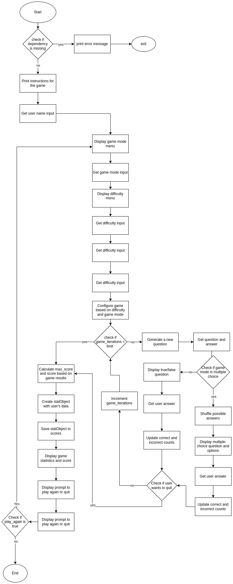

# Python Trivia

## 1.1 Purpose

The Purpose of this Project is to provide a way to kill some time whenever someone is sitting in from of their computer and does not know what to do. Most of the questions are general knowledge questions, which means that one can even learn from being bored.

## 1.2 Goals

1. Offer multiple game modes
   - The game should offer multiple choice and true false until 12 of jun 2023.
2. Persisted scores

   - Scores achieved by an user should be saved in a database until 12 of jun 2023.

3. Offer Different Difficulty Levels
   - The game should offer 3 difficulty levels from easy to hard until 12 of jun 2023.

## 1.3 Requirements

**Python Modules:**

- `random` Used for generating random values and shuffling options.
- `os` Used to rerun the game if the user wants to.
- `urllib` Used for making HTTP requests to retrieve the questions from external sources.
- `json` Used to save the games in a JSON file.
- `math` Used for various mathematical operations.

**Custom Libraries:**

- `menu`: Provides functions for displaying menus. For example, it is used in the `menu` function calls to display the game mode menu and difficulty menu.
- `newQuestion`: Provides a function for retrieving new quiz questions from an API based on the selected topic, difficulty level, and game mode. For example, it is used in the `data = newQuestion(topic, difficulty, game_mode)` line to fetch a new question.
- `progressBar`: Provides a function for generating a progress bar visualization. For example, it is used in the `progressBar(100 / int(max_score) * int(score), 20)` line to display the user's progress.
- `toScores`: Provides a function for storing user scores in the "scores.json" file. For example, it is used in the `to_scores(statObject, game_mode)` line to save the user's statistics.
- `validate`: Provides a function for validating user input. For example, it is used in the `game_mode = validate('Choose a game mode', ['1', '2'])` line to validate the user's selection.
- `getColor`: Provides a function for retrieving color codes based on a given input. For example, it is used in the `get_color(firstTry)` line to get the color for displaying the "first try" text.
- `multipleChoice`: Provides a function for handling multiple-choice questions and user answers. For example, it is used in the `questionStats = (multipleChoice(format_string(question), answer, format_string(options)))` line to process the user's answer.
- `trueFalse`: Provides a function for handling true/false questions and user answers. For example, it is used in the `questionStats = (true_false(format_string(question), answer))` line to process the user's answer.
- `podium`: Provides a function for displaying a podium with the user's name, score, and game mode. For example, it is used in the `podium(name, score, game_mode)` line to show the user's performance.
- `colored`: Provides a function for coloring text in the console. For example, it is used in the `print(colored('Please make sure that every module is installed.\nRequired modules: \n - random\n - os\n - urllib\n - json\n ' '- math\n  Disconnected to avoid redundancies in the JSON file.', 'red'))` line to display an error message in red color.
- `format`: Provides functions for formatting strings. For example, it is used in the `question = format_string(data['results'][0]['question'])` line to format the question text.

## 1.4 Inputs

The script accepts the following inputs from the user:

1. **User Name:** The user is prompted to enter their preferred name to be used throughout the game.
2. **Game Mode:** The user selects the game mode (either true/false or multiple-choice) they want to play.
3. **Difficulty:** Level: The user chooses the difficulty level (easy, medium, or hard) for the quiz questions.
4. **Topic Selection:** The user selects a specific topic or chooses to play with questions from any category.
5. **Scores:** Previous scores get read via SQLite from the database.db file.

## 1.5 Outputs

The script provided outputs are:

1. **Quiz Questions:** The script retrieves questions from an API based on the selected topic, difficulty level, and game mode. The questions are then presented to the user.
2. **Answer Options:** For multiple-choice questions, the script shuffles the answer options and displays them to the user.
3. **User Interaction:** The script prompts the user to answer the questions by selecting the correct option or providing a true/false response.
4. **Game Statistics:** The script keeps track of the user's performance, including the number of correct and incorrect answers, first try successes, and overall score.
5. **Score Calculation:** The script calculates the user's score based on their performance, taking into account factors such as correct answers, incorrect answers, and difficulty level.
6. **Progress Bar:** The script displays a visual representation of the user's progress through a progress bar.
7. **Game Results:** After completing the game, the script presents the user with their final score, performance statistics, and an option to play again or quit the game.
8. **Scores:** New Scores get saved via SQLite in to the database.db file.

## 2.0 Flowchart



## 5.1 Usecases

### (T1) |15 questions get asked of true-false is selected on easy mode


### UC1
This test case is used to verify the functionality of the program when 15 true-false questions are asked in easy mode. It ensures that the program runs without errors and that the questions can be skipped or answered correctly. The expected result is that the program does not terminate prematurely and after answering or skipping the 15th question, the podium is displayed.

### UC2 
This test case is used to verify the diversity of multiple-choice questions in different categories or modes. It checks whether the questions in each category fit the designated category and are not related to any other topic. The test involves playing the quiz in two different sessions, noting the questions in each session, and ensuring that no question from the first category appears in the second category. The expected result is that the questions align with their respective categories and do not overlap between sessions.

## 5.2 Test results
### (T1 for UC1) 15 questions get asked of true-false is selected on easy mode
**Prerequisites:**

- The script is started
- The dependency error handling did not trigger
- A name was given

**Test:**

1. In the gamemode menu, select (1)
2. In the difficulty menu, select (1)
3. Choose any number (0..24)
4. Type `skip` on every question or answer it

**Expected results:**
One was able to skip or answer the questions exactly 15 times. The program did not end early and after answering for the 15th time, the podium displayed.

### (T2) The multiple choice questions are different in every category/fit the category

### (T2 for UC2) The multiple choice questions are different in every category/fit the category
**Prerequisites:**

- The script is started
- The dependency error handling did not trigger
- A name was given

**Test:**

1. In the gamemode menu, select (2)
2. In the difficulty menu, select any mode (1..3)
3. Choose any number (1..24) except 1
4. Play quiz and note the questions
5. Choose (1) in the play again menu
6. In the gamemode menu, select (2)
7. In the difficulty menu, select any mode (1..3)
8. Choose any number (1..24) except 1. Make sure not to select the same as last time
9. Note questions

**Expected results:**
The questions fit the category and are not about any other topic than what the category is titled. Also a question from the first category should never appear in the second category.

### (T3) Database: If no database file exist create file:

**Prerequisites**

- The script is downloaded.
- There is no database.db file (if it exists delete it)

**Test:**

1. Start the script

```bash
python3 path/to/main.py
```

2. Enter a name
3. Stop the script using "CTRL + C"

**Expected Results:**
Inside the folder structure there should be a file name database.db

## 5.2 Test results

| Test ID | Successful |
| ------- | ---------- |
| T1      | yes        |
| T2      | yes        |
| T3      | yes        |
